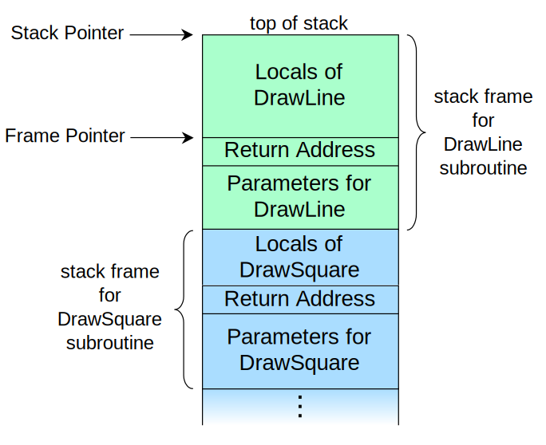

# Algorithms

## Introduction to algorithms
An **algorithm** is a set of instructions for accomplishing a task.

*Pseudocode* is a high-level description of the problem you're trying to solve, in code.

### Math
log10(100) is like aksing: how many 10s do we multiply together to get 100? Answer is 2: 10 * 10, so log10(100)=2.
logs are the flip of exponentials: 2^3=8 <-> log2(8)=3

### Call stack
The stack used to save the variables for multiple functions, is called the *call stack*.
Every time you make a function call, your computer saves the values for all the variables for that call in memory.



when you call a function from another function, the calling function is paused in a partially completed state. All the values of the variables for that function are still stored in memory.

The topmost box in the stack tells you the call you're currently on.

Each of those function calls takes up some memory, and when your stack is too tall, that means you computer is saving information for many function calls. At that point, you have two options:
- rewrite your code to use a loop instead.
- use *tail recursion*. (only supported in some languages, not all)

Each program has a limited amount of space on the call stack. When your program runs out of space (which it eventually will), it will exit with a *stackoverflow* error.


### Recursion
- Recursion is where a function calls itself
- Recursion is used when it makes the solution clearer.
- There's no performance benefit to using recursion; in fact, loops are sometimes better for performance.
- Every recursive function has two parts: the base case, and the recursive case.
- Recursive case is when the function calls itself.
- The base case is when the function doesn't call itself again.. so it doesn't go into an infinite loop.

```python
def countdown(i):
  print i
  if i<= i: // base case
    return
  else: // recursive case
    countdown(i-1)
```

*Tip*: when writing a recursing function involving an array, the base case is often an empty array or an array with one element.

### Big O notation
Tells how fast an algorithm grows.
Algorithm times are measured in terms of *growth* of an algorithm.
It's not enough to know how long an algorithm takes to run - you need to know how the running time increases as the list size increases. That's where Big O notation comes in. E.g. as the number of items increases, binary search takes a little more time to run. But simple search takes a lot more time to run.
`O(n)` is synonym to *it will take `n` operations*.
Where are the seconds? There are none - Big O doesn't tell you the speed in seconds. **Big O notation lets you compare the number of operations. It tells you how fast the algorithm grows.
Big O notation is about th worst-case scenario: in the worst case, you'll have to look at every entry in the phone book once. It's a reassurance - you know that simple search will never be slower than O(n) time.

The constant in Big O notation can matter sometimes. That's why quicksort is faster than merge sort.
The constant almost never matters for simple search versus binary search, because `O(log n)` is so much faster than `O(n)` when the list gets big.

#### Common Big O run times
- `O(log n)`: also known as *log time*, e.g. Binary Search
- `O(n)`: also known as *linear time*, e.g. Simple Search
- `O(n * log n)`: fast sorting algorithm, e.g. quicksort
- `O(n^2)`: slow sorting algorithm, e.g. selection sort
- `O(n!)`: really slow algorithm, e.g. traveling salesperson
- `O(1)`: constant time. Time taken will stay the same, regardless of how big the array/table/... is.

#### Take aways
- Algorithms speed isn't measured in seconds, but in growth of the number of operations.
- Instead, we talk aobut how quickly the run time of an algorithm increases as the size of the input increases
- Run time of algorithms is expressed in Big O notation
- O(log n) is faster than O(n), but it gets a lot faster as the list of items you're searching grows.
- O(n + 26), O(n * 26), O(n/26) are all the same as O(n)

### Simple search
The maximum number of guesses is the same as the size fo the list: this is called *linear time*.: O(n)

### Binary search
input: sorted list of elements
ouput: returns the position where an element is in that list, otherwise `null`.

With binary search, you guess the middle number and eliminate half the remaining numbers every time.
For any list of `n`, binary search will take `log2(n)`steps to run the worst case.

Binary search runs in *logarithmic time* (or *log time*, as th natives call it): O(log n), needs log n operations to check a list of size n.

## Breadth-first search (BFS)
The algorithm to solve a shortest-path problem is called breadth-first search.
It helps answer two types of questions:
- Question type 1: is there a path from node A to node B?
- Question type 2: what is the shortest path from node A to node B?

Use cases:
- write a checkers AI that calculates the fewest moves to victory
- write a spell checker (fewest edits from your misspelling to a real word - e.g READED -> READER is one edit)
- find the doctor closest to you in your network

Implementing a graph: 
```python
graph = {} # data structure hash table let you express relationship
graph["you"] = ["alice", "bob", "claire"] # give you an array of all the neighbors of 'you'.
```

If you have a problem like "find the shortest X", try modeling your problem as a graph, and use breadth-first search to solve.

A directed graph has arrows, and the relationship follows the direction of the arrow.

Undirected graphs don't have arrows, and the relationship goes both ways.

## Dijkstra's algorithm
BFS gives not necesarily the fastest path, but the shortest (fewest) path, because it has the least number of segments.
Dijkstra's algorithm finds the path with the smallest total weight.

There are four steps to Dijstra's alorithm:
1. Find the 'cheapest node'. This is the node you can get to in the least amount of time.
2. Update the costs of the neighbors of this node. I.e. check whether there's a cheaper path to the neighbors of this node. If so update their costs.
3. Repeat until you've done this for every node in the graph.
4. Calculate the final path.

Limitation:
You can't use Dijkstra's algorithm if you have negative-weight edges. If you want to find the shortest path in a graph that has negative-weight edges, use *Bellman-Ford algorithm*.

## Greedy algorithms
A greedy algorithm is simple: at each step, pick the *optimal* move. In technical terms: *at each step you pick the locally optimal solution*, and in the end you're left with the globally optimal solution.
Obviously, greedy algorithms don't always work. But they're simple to write!
Sometimes, perfect is the enemy of good. Sometimes all you need is an algorithm that solves the problem pretty well. That's where greedy algorithms shine, because they're simple to write and usually get pretty close.

Use cases: 
- approximations
- easy solution that works well but not optimal.

Note: Dijkstra is a greedy algorithm.

### Approximation algorithms
Approximation algorithms are judged by:
- how fast they are
- how close they are to the optimal solution

Greedy algorithms are a good choice because not only are they simple to come up with, but that simplicity means they usually run fast, too.

### NP-complete
NP-completness: problems famously hard to solve. The *set-covering* problem and *traveling salesperson* are two examples. There's no easy way to tell if the problem you're wofking on is NP complete. Here are some giveaways:
- your algorithms runs quickly with a handful of items but really slows down with more items.
- 'all combinations of X' usually point to an NP-complete problem.
- do you have to calculate 'every possible version' of X because you can't break it down into smaller sub-problems? Might be NP-complete
- if your problem involves a sequence (suche as a sequence of cities, lile traveling salesperson), and it's hard to solve, it might be NP-complete.
- if your problem involves a set (like a set of radio stations) and it's hard to solve, it might be NP-complete
- can you restate your problem as the set-covering problem or the traveling-salesperson problem? Then your problem is definitely NP-complete.
  

If the problem you're trying to solve is NP-complete: stop trying to solve it perfectly, and solve it using an approximation algorithm instead.

## Dynamic programming
Dynamic programming starts by solving subproblems and builds up to solving the big problem.

Every dynamic-programming algorithm starts with a grid. The grid starts out empty. You're going to fill in each cell of the grid. Once the grid is filled in, you'll have your answer to the problem.

Dynamic programming only works when each subproblems is *discrete* - when it doesn't depend on other subproblems.

Dynamic programming is useful when you're trying to *optimize something given a constraint*. E.g. in the knapsack problem, you had to maximize the value of the goods you stole, constrained by the size of the knapsack.

You can use dynamic programming when the problem can be broken into *discrete* subproblems, and they don't depend on each other.

Some general tips:
- Every dynamic-programming solution involves a grid.
- The values in the cells are usually what you're trying to optimize. For the knapsack problem, the values were the value of the goods.
- Each cell is a subproblem, so think about how you can divide your problem into subproblems. That will help you figure out what the axes are.

## Selection sort
- input: unsorted array
- output: sorted array
- Run time: O(n * n) or O(n^2)

## Quick sort
### How does it work?
1. Pick a *pivot*
2. Paritition the array into two sub-arrays: elements less than the pivot and elements greater than the pivot.
3. Call quicksort recursively on the two sub-arrays.

### Code?
```python
def quicksort(array):
  if len(array) < 2:
    return array // base case: arrays with 0 or 1 element are already "sorted".
  else:
    pivot = array[0] // recursive case
    less = [i for i in array[1:] if i <= pivot] // sub-array of all the elements less than the pivot
    greater = [i for i in array[1:] if i > pivot] // sub-array of all the elements greater than the pivot
    return quicksort(less) + [pivot] + quicksort(greater)

print quicksort([10, 5, 2, 3])
```

### Big O notation?
Quicksort's speed depends on the pivot you choose.
Worst case: the stack size is `O(n)`.
Best case: the stack size is `O(log(n))`. You can get the best case consistently, as long as you always choose a random element as the pivot.

Best-case scenario: The height of the call stack is `O(log(n))`, and each level takes `O(n)` time. The entire algorithm will take `O(n)*O(log n)=O(n log n)`. 
Worst-case scenario: there are `O(n)` levels, so the algorithm will take `O(n)*O(n) = O(n^2)` time.
Average case scenario: if you always choose a random element in the array as the pivot, quicksort will complete in `O(n log n)` time on average. So, the best case is also the average case.

# Algorithm design paradigm
## Divide and conquer
Use case example: Quicksort

D&C isn't a simple algorithm to apply to a problem. Instead, it's a way to think about a problem.

- Use recursion to solve problems.
- Divide and conquer algorithms are recursive algorithms.
- To solve a problem using D&C, there are two steps:
  1. Figure out the base case. This should be the simplest possible case.
  2. Divide or decrease you problem until it becomes the base case. 

# Data structures
## Array
- if out of space, need to move to a new spot in memory every time, adding new item will be really slow.
- using an array means all your tasks are stored contiguously
- memory must have n free **contiguous** slots, other can't get space for array.
- great if you want to read random elements, because you can look up any element in your array instantly.
- Terminology: 
  - elements in an array are numbered, start from 0. Makes all kinds of array-based code easier to write.
  - position of an element is called its *index*. Instead of saying, '20 is at position 1', the correct terminology is, '20 is at index 1'.
  - allow random access: can jump directly to the 10th element. A lot of use cases require random access, so arrays are used a lot.

## Linked list
- each item stores the address of the next item in the list. A bunch of random memory addresses are linked together.
- adding an item is easy: you stick it anywhere in memory and store the address with the previous item.
- must not have n free **contiguous** slots, can be split in memory.
- cann't just read the last item, because you don't know what address it's at. Have to go to item #1 to get the address for item #2. And so on, until you get the the last item.
- are great if you're going to read all the items one at a time: you can read one item.
- terrible if you're going to keep jumping around
- with a linked list, the elements aren't next to each other, so you can't instantly calculate the position of the fifth element in memory - you have to go to the first element to get the address to the second element, then go to the second element to get the address of the third element, and so on until you get to the fifth element.
- allow sequential access: reading the elements one by one, starting at the first element. Linked lists can *only* do sequential access.

## Queue
You can't access random elements in the queue. Instead, there are two only operations, *enqueue* (or *push*) and *dequeue* (or *pop*).
The queue is called a *FIFO* data structure: First In, First Out. In contrast, a stack is a *LIFO* data structure: Last In, First Out.

```python
from collections import deque
search_queue = deque() # creates a new (double-ended) queue
search_queue += graph["you"] # adds all your neighbors to the search queue
```

## Stack
When you insert an item, it gets added to the top of the list.
When you read an item, you only read the topmost item, and it's taken off the list.

Only two actions: *push* (insert) and *pop* (remove and read).

## Hash tables
Synonyms: hash maps, maps, dictionaries, and associative arrays.

A hash table maps keys to values.

Hash tables have no ordering, so it doesn't matter what order you add key/value pairs in.

### Hash functions
A hash functions is a function that maps a sequence of bytes, e.g. a string, to a number.

Requirements for hash functions:
- consistency: every time you put in 'apple', you should get '4' back.
- map different words to different numbers: hash function is no good if it always return '1' for any word you put in. In the best case, every different word should map to a different number.

collision: two keys have been assigned the same slot. A good hash function has a very few collisions. To avoid collisions, you need:
- low load factor: `nb of items in hash table / total nb of slots`. With a lower load factor, you'll have fewer collisions, and your table will perform better. Rule of thumb: resize when your load factor is greater than 0.7. Resizing means adding more slots to your hash table by creating a new array that's bigger. Rule of thumb is to make an array that is twice the size.
- good hash function: a good hash function distributes values in the array evenly. A bad hash function groups values together and produces a lot of collisions. E.g. `SHA`

### Use cases
Hash tables are great when you want to:
- create a mapping from one thing to another thing,
- look something up

Common use cases:
- modeling relationships from one thing to another thing, i.e. lookups, e.g. phonebook, DNS resolution
- filtering out duplicated entries, e.g. voting check list
- caching/memorizing data, e.g. caching web page

## Run times for common operations:
||Hash Tables (average)| Hash tables (worst)|Array|List|
|-|-|-|-|-|
|Reading|O(1)|O(n)|O(1)|O(n)|
|Insertion|O(1)|O(n)|O(n)|O(1)|
|Deletion|O(1)|O(n)|O(n)|O(1)|

It's a common practice to keep track of the first and last items in a linked list, so it would take only O(1) time to delete those.

Type of access: *random access* and *sequential access*

Linked lists are good for inserts/deletes, and arrays are good for random access.
Arrays allow fast reads.
Linked lists allow fast inserts and deletes.
All elements in the array should be the same type (all ints, all doubles, and so on).

# References
- grokking, algorithms